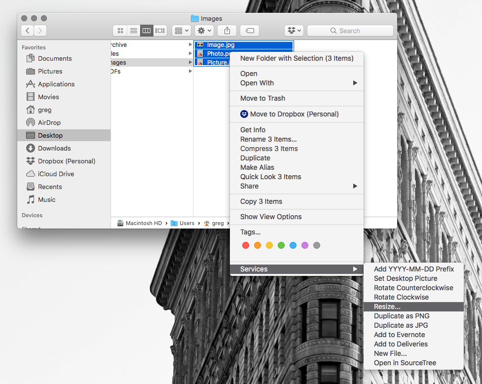
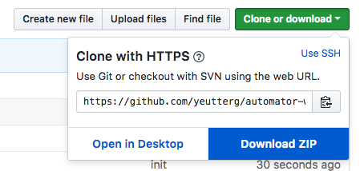
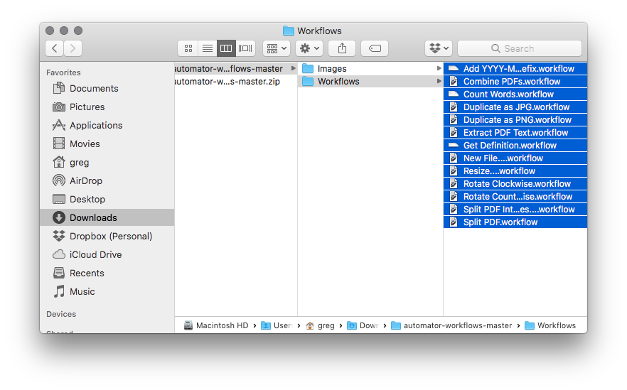
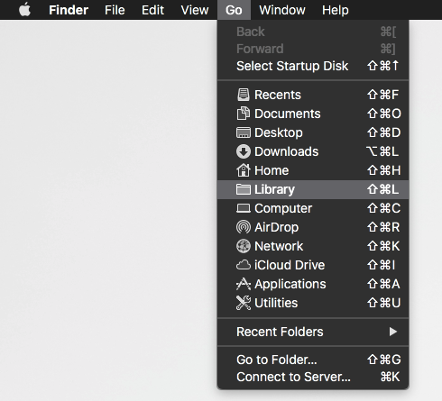
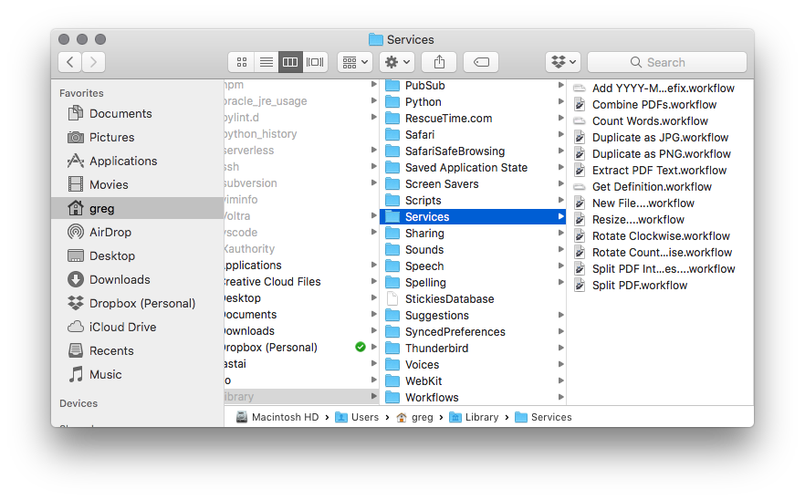

# MacOS Automator Workflows

Updated 2018-09-27

## Overview

[Automator](https://macosxautomation.com/automator/) is an application bundled with MacOS that allows you to save time by automating repetitive, time-consuming tasks. 

This page details services I've developed that you can install and use on your own Mac.

Some examples include:
* Splitting and combining PDFs
* Batch resizing images
* Converting a PDF into images
* Looking up a highlighted word using the Dictionary app
* Counting highlighted words

You can perform all these actions without even opening applications. Just right-click (control-click) a file or folder, and valid operations will be found in the Services menu. The services work system-wide, including in Finder and text areas.

## Newsletter

I occasionally update this page with new scripts and changes to existing scripts. [Sign up](https://mailchi.mp/96b4aba92716/macos) to be notified of updates.

## Table of Contents
* [Installation and Use](#installation)
* [Image Services](#image)
* [PDF Services](#pdf)
* [File Services](#file)
* [Text Services](#text)
* [License](#license)

##  Installation and Use

1. From this page, download the workflows by clicking Clone or Download > Download ZIP.

2. Find the zip file you just downloaded. Extract it by double-clicking.

3. Within the extracted zip folder, navigate to the Workflows folder. Select all the workflows you want to install (hold down the Command key while clicking to select multiple). Command-C to copy those workflows.

4. From Finder, hold down the option (alt) key and click the Go menu at the top of your screen. Click Library. 

5. In the Library folder, navigate to Services. Command-V to paste the workflows into the Services folder.

You should be all set. See the descriptions and videos below for more info on how to use these workflows.

If you find a bug or need help, please [contact me](https://gregyeutter.com/connect) or report an issue on this page.

##  Image Services

### Resize 

Creates a copy of an image or images and scales to a specific pixel width. 

**NOTE:** The resulting image is not as high quality as one generated in an image editor, e.g. Photoshop. This is better for quick tasks for which quality is not a priority.

To use:
1. Select an image or multiple images
2. Right-click or Command-click the selection
3. Under Services, select Resize...
4. In the dialog box that appears，select the width of the target image(s) and click OK or hit return
5. A new file will appear in the same folder but with a slug of _XXXpx and matching size

[Demo Video](https://youtu.be/fUT4T3w-fzc)

### Rotate Clockwise

Rotates an image or images clockwise.

To use:
1. Select an image or multiple images
2. Right-click or Command-click the selection
3. Under Services, select Rotate Clockwise
4. The file(s) will be rotated

[Demo Video](https://youtu.be/z0tToPspiEE)

### Rotate Counterclockwise

Rotates an image or images counterclockwise.

To use:
1. Select an image or multiple images
2. Right-click or Command-click the selection
3. Under Services, select Rotate Counterclockwise
4. The file(s) will be rotated

[Demo Video](https://youtu.be/wxgYt7VYTL0)

### Duplicate as PNG

Makes a copy of an image or images and converts to PNG.

To use:
1. Select an image or multiple images
2. Right-click or Command-click the selection
3. Under Services, select Duplicate as PNG
4. The PNG file(s) with the same name will appear in the same folder

[Demo Video](https://youtu.be/kn2kyLWRZrE)

### Duplicate as JPG

Makes a copy of an image or images and converts to JPG.

To use:
1. Select an image or multiple images
2. Right-click or Command-click the selection
3. Under Services, select Duplicate as JPG
4. The JPG file(s) with the same name will appear in the same folder

[Demo Video](https://youtu.be/T6PcXw0G3uQ)

##  PDF Services

### Split PDF

Splits a multi-page PDF into single-page PDFs.

To use:
1. Select a PDF
2. Right-click or Command-click the selection
3. Under Services, select Split PDF
4. The individual PDFs will appear in the folder

[Demo Video](https://youtu.be/tyXjdmpxURE)

### Split PDF into Images

Saves every page of a PDF as an image.

To use:
1. Select a PDF
2. Right-click or Command-click the selection
3. Under Services, select Split PDF into Images...
4. A dialog box will appear. You can select the colorspace, file type, resolution, and compression. When satisfied, click Continue
5. The images for each page will appear in the folder

[Demo Video](https://youtu.be/rQhnncknWss)

### Combine PDFs

Combines multiple selected PDF files into one.

To use:
1. Select multiple PDFs (hold down Command while clicking)
2. Right-click or Command-click the selection
3. Under Services, select Combine PDFs...
4. A dialog box will appear. Type a filename in the text field. Omit the .pdf extension
5. The combined file will be saved in the same folder

[Demo Video](https://youtu.be/6FNhlAEA1WQ)

### Extract PDF Text

Extracts the text from a PDF and saves it to a text file of the same name. Note that the PDF must have selectable text for this to work.

To use:
1. Select a PDF or PDFs
2. Right-click or Command-click the selection
3. Under Services, select Extract PDF Text
4. A new text file will appear with the same name as the PDF

[Demo Video](https://youtu.be/GVt9Pxvefh4)

##  File Services

### New File

Creates an empty file in the current directory. You specify the filename, including extension, in the dialog box that appears. Note that this only works for Unicode text file formats like .txt, .md, and .html. It will not work for something like .xlsx or .docx.

To use:
1. Select a file or folder
2. Right-click or Command-click the selection
3. Under Services, select New File...
4. Specify the filename, including extension, in the dialog box that appears
5. Click OK or press return
6. The new file will appear in the same folder

[Demo Video](https://youtu.be/v5Zr9pRmVBY)

### Add YYYY-MM-DD Prefix

Adds today's date in YYYY-MM-DD format as a prefix to the selected filename(s) or folder name(s).

To use:
1. Select one or multiple files or folders
2. Right-click or Command-click the selected files(s) or folder(s)
3. Under Services, select Add YYYY-MM-DD Prefix
4. The prefixes will be added to the selection

[Demo Video](https://youtu.be/NbmmlnBoBj8)

##  Text Services

### Count Words

Counts the number of highlighted words.

To use:
1. Select text
2. Right-click or Command-click the selected text
3. Under Services, select Count Words
4. A dialog box will appear with the word count

[Demo Video](https://youtu.be/pBuI8H2Hmic)

### Get Definition

Opens Dictionary.app with the highlighted text as the query. This gives you more flexibility than the force-click/right-click Look Up menu, as it opens the whole Dictionary app.

To use:
1. Select a word or phrase
2. Right-click or Command-click the selected text
3. Under Services, select Get Definition
4. Dictionary will open and display the definition

[Demo Video](https://youtu.be/D2Acih-eMVY)

##  License

These workflows are provided for free without warranty. I can't guarantee these will work properly on your system. If a file becomes unusable or damaged because you used one of these scripts, it's not my fault.

All workflows on this page were tested on a system running MacOS High Sierra.